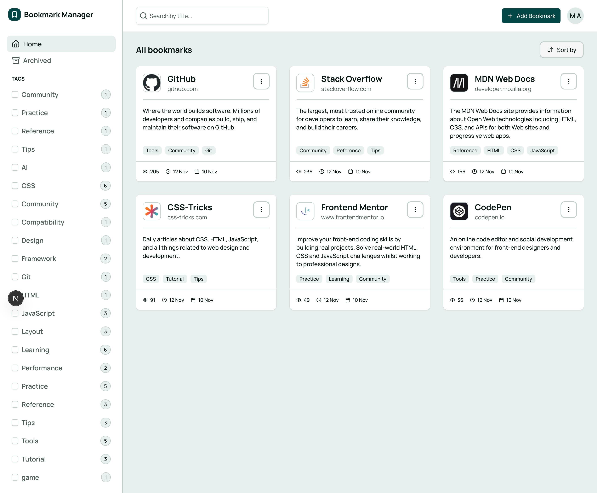
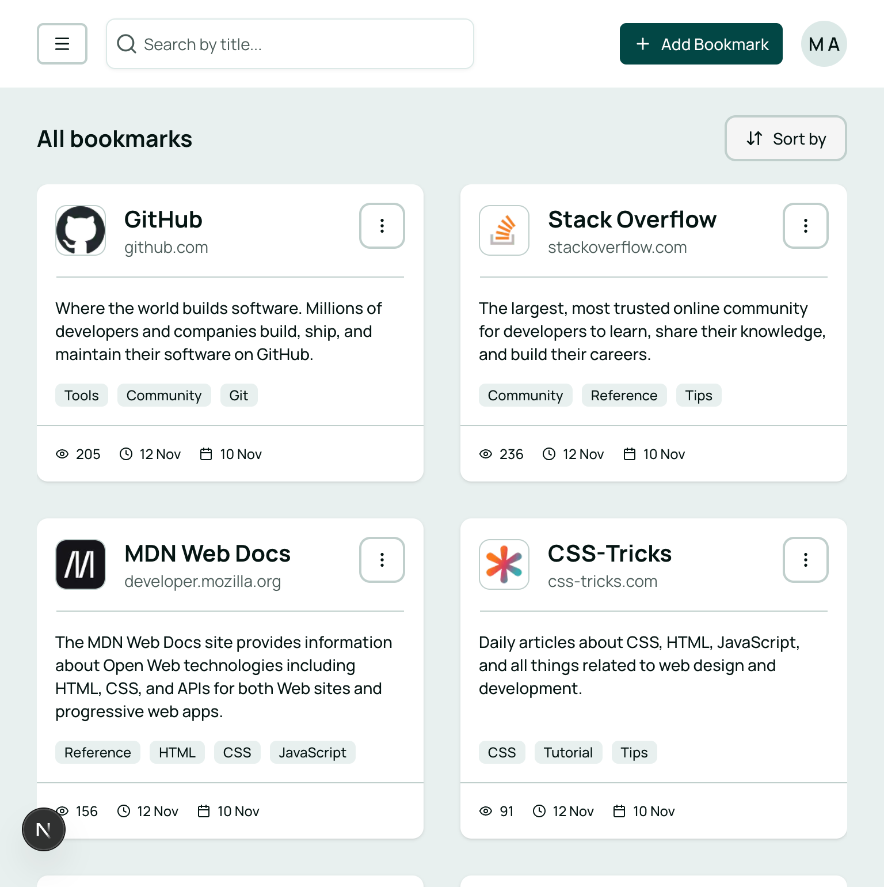
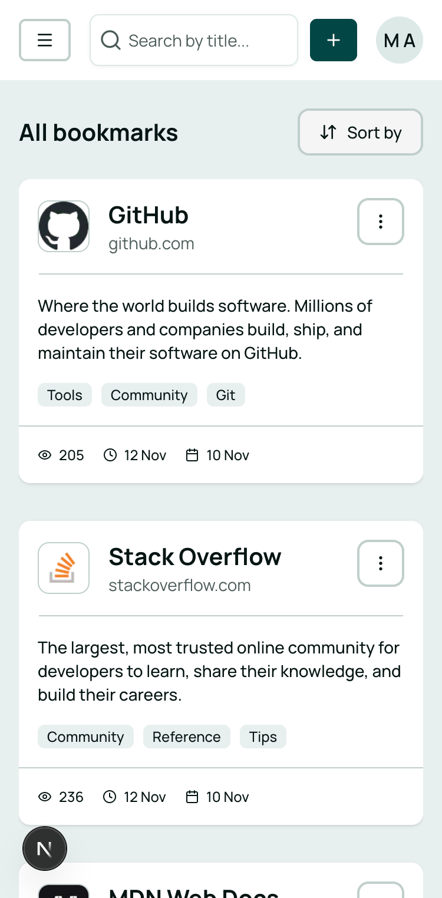

# Frontend Mentor - Bookmark manager app solution

## Table of contents

- [Overview](#overview)
  - [The challenge](#the-challenge)
  - [Screenshot](#screenshot)
  - [Links](#links)
- [My process](#my-process)
  - [Built with](#built-with)
  - [What I learned](#what-i-learned)
  - [Useful resources](#useful-resources)
- [Author](#author)

## Overview

### The challenge

Users should be able to:

- Add new bookmarks with a title, description, website URL, and tags
- View all their bookmarks
- See bookmark details including favicon, title, URL, description, tags, view count, last visited date, and date added
- Search for bookmarks by title in the search bar
- Filter bookmarks by selecting one or multiple tags from the sidebar
- Reset tag filters to view all bookmarks again
- View archived bookmarks
- Archive bookmarks to remove them from the main view without deleting them
- Pin/unpin bookmarks to keep important ones easily accessible
- Edit existing bookmarks to update their details
- Copy bookmark URLs to the clipboard
- Visit bookmarked websites directly from the app
- Sort bookmarks by "Recently added", "Recently visited", or "Most visited"
- Toggle between light and dark color themes
- View the optimal layout for the interface depending on their device's screen size
- See hover and focus states for all interactive elements on the page

### Screenshot

### Links

- Solution URL: (https://github.com/maziarja/feedback-product)
- Live Site URL: (https://bookmark-manager-rosy.vercel.app)

## My process

### Built with

- Semantic HTML5 markup
- CSS custom properties
- Flexbox
- CSS Grid
- Mobile-first workflow

- [Next.js](https://nextjs.org/) - React framework
- [Tailwind CSS](https://tailwindcss.com) - For styles
- [shadcn/ui](https://ui.shadcn.com) - For accessible and composable UI components
- [MongoDB](https://www.mongodb.com) and [Mongoose](https://mongoosejs.com) - For data modeling and database management
- [NextAuth.js (v5)](https://authjs.dev) - For authentication

### What I learned

This is the first time I'm using **shadcn/ui**. I tried to customize it to match the design challenge as closely as possible.  
I also used this very practical website to help me: (https://tweakcn.com)

### Useful resources

- [Tweaky ShadCN](https://tweakcn.com) - This practical site helped me customize shadcn/ui components to match the design challenge more accurately.

## Author

- Frontend Mentor - [@maziarja](https://www.frontendmentor.io/profile/maziarja)
- Twitter - [@maz_alem](https://x.com/maz_alem)
- LinkedIn - [@maziar-jamalialem](https://www.linkedin.com/in/maziar-jamalialem-677030345/)
